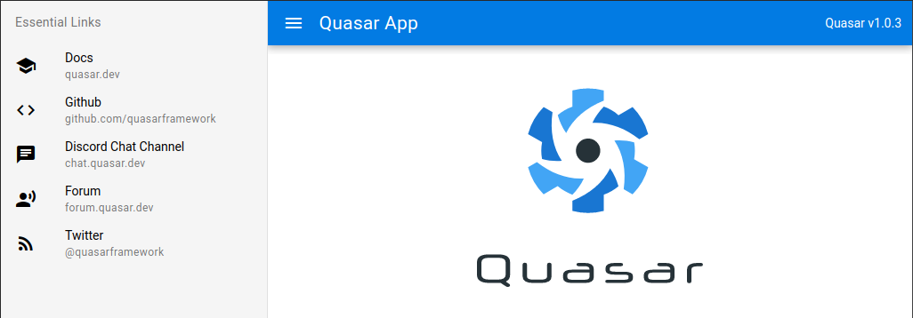
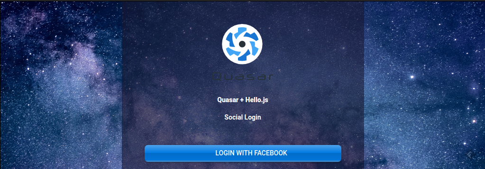

# Quasar + Hello.js

> This is the English loose translation of [its Portuguese version](https://github.com/patrickmonteiro/quasar-hello-auth/blob/0ca0e4f3a766d1d519ac9989d5127c2316feca6a/README.md) (pt-br 🇧🇷) authored by [Patrick Monteiro](https://github.com/patrickmonteiro) but using Quasar Framework **v1.0.3**.

This tutorial explains how to create an application using [Quasar Framework](https://quasar.dev) and [Hello.js](https://adodson.com/hello.js/) (for the social login).

Quasar has recently reached its stable version (`v1`). That's the version going to be used in this tutorial.


## The hello.js

> _A client-side JavaScript SDK for authenticating with OAuth2 (and OAuth1 with a oauth proxy) web services and querying their REST APIs. HelloJS standardizes paths and responses to common APIs like Google Data Services, Facebook Graph and Windows Live Connect._  
(source: [official website](https://adodson.com/hello.js/#hellojs))

---

## Requirements

You will need to have the following previously installed before proceed.

* [Node.js](https://nodejs.org/en/)
* [Yarn](https://yarnpkg.com/en/)
* [Vue CLI](https://cli.vuejs.org/)
* [Quasar CLI](https://quasar.dev/quasar-cli/installation)

## Creating the project

To create the new project run the following command:

```
quasar create quasar-hello-auth
```

Quasar CLI will ask a few questions. You can press `ENTER` to proceed with the default values or change accordingly.

```

  ___                             
 / _ \ _   _  __ _ ___  __ _ _ __ 
| | | | | | |/ _` / __|/ _` | '__|
| |_| | |_| | (_| \__ \ (_| | |   
 \__\_\\__,_|\__,_|___/\__,_|_|   
 


? Project name (internal usage for dev) quasar-hello-auth
? Project product name (official name; must start with a letter if you will build mobile apps) Quasar App
? Project description A Quasar Framework app
? Author William Comnisky <w.comnisky@gmail.com>
? Check the features needed for your project: ESLint, Vuex, Axios, Vue-i18n
? Pick an ESLint preset Standard
? Cordova id (disregard if not building mobile apps) org.cordova.quasar.app
? Should we run `npm install` for you after the project has been created? (recommended) yarn

```

When it asks `Check the features needed for your project` you can navigate through the options with the `Arrow keys` and select/unselect them using the `Space key`. Check the options selected in the block above.

Once it finishes the installation it shows:

```bash
To get started:

  cd quasar-hello-auth
  quasar dev
```

The application will start and be available at [http://localhost:8080/](http://localhost:8080/).



## Adding Hello.js to the project

To install it run the following command in the project root folder:

```
npm i hellojs
```

To confirm the successful installation you should find a reference of Hello.js in the `package.json` as it follows:

```json
  "dependencies": {
    "@quasar/extras": "^1.0.0",
    "axios": "^0.18.1",
    "hellojs": "^1.18.1",
    "quasar": "^1.0.0",
    "vue-i18n": "^8.0.0"
  },
```

## Creating the Hello.js boot file

To have access to Hello.js inside Quasar we will have to create a boot file. To do so create a file named `hello.js` into the path `src/boot` with the following code:

```js
import hello from 'hellojs'

export default ({ Vue }) => {
  hello.init({
    facebook: 'your-facebook-client-id-here'
  })
  Vue.prototype.$hello = hello
}
```

Note the parameter `facebook` in the code above. Its value will be changed later on with the ID generated in your Facebook for Developers.

Now edit the `quasar.conf.js` file and add `hello` into the boot list:

```js
    boot: [
      'i18n',
      'axios',
      'hello'
    ],
```

## Creating the Login Layout

A new layout will be created to be used in the authentication screen.

Create a file named `LoginLayout.vue` in the into the path `src/layouts` with the following code:

```html
<template>
  <q-layout view="lHh Lpr lFf"
    class="img-background" >
   <q-page-container class="container-fluid">
      <router-view />
    </q-page-container>
  </q-layout>
</template>

<style>
::-webkit-scrollbar {
  display: none;
}
.img-background{
  background: #fff url(../statics/background-img.jpg);
  /* Full height */
  height: 100%;
  /* Center and scale the image nicely */
  background-position: center;
  background-repeat: no-repeat;
  background-size: cover;
  border: solid 1px black
}
</style>
```

The CSS backgroun image can be downloaded from the following link. Rename it to `background-img.jpg` and place it into the `statics/` folder.

* https://pixabay.com/photos/astronomy-bright-constellation-dark-1867616/

Now create the page file `Login.vue` into the path `src/pages` with the following code:

```html
<template>
    <q-page  class="docs-input row justify-center">
        <div class="col-xl-4 col-lg-6 col-md-6 col-sm-12 col-xs-12 q-pa-xl dark">
          <div class="text-center" style="color:white">
            
            <p class="q-display-1 text-weight-bolder q-pt-lg">Quasar + Hello.js</p>
            <p class="q-title text-weight-bold q-ma-none">Social Login</p>
          </div>
          <div class="q-mt-xl">
            <q-btn
              color="primary" glossy push class="full-width"
              icon="fab fa-facebook-f" label="Login with Facebook"
              size="md" @click="auth('facebook')" >
            </q-btn>
          </div>
       </div>
    </q-page>
</template>

<script>
export default {
  name: 'Login',
  methods: {
    auth (network) {
      this.$hello(network).login({ scope: 'friends' })
        .then(() => {
          this.$router.push('profile')
        })
    }
  }
}
</script>

<style scoped>
.dark{
  background: #1817309a;
}
</style>
```

To be able to access the new page its route has to be created.

Edit the `src/router/routes.js` file and replace its content with the following:

```js
const routes = [
  {
    path: '/',
    component: () => import('layouts/MyLayout.vue'),
    children: [
      { path: '', component: () => import('pages/Index.vue') }
    ]
  },
  {
    path: '/login',
    component: () => import('layouts/LoginLayout.vue'),
    children: [
      { path: '', component: () => import('pages/Login.vue') }
    ]
  }
]

// Always leave this as last one
if (process.env.MODE !== 'ssr') {
  routes.push({
    path: '*',
    component: () => import('pages/Error404.vue')
  })
}

export default routes
```

Access the URL [http://localhost:8080/#/login](http://localhost:8080/#/login) to confirm if it works as expected:

